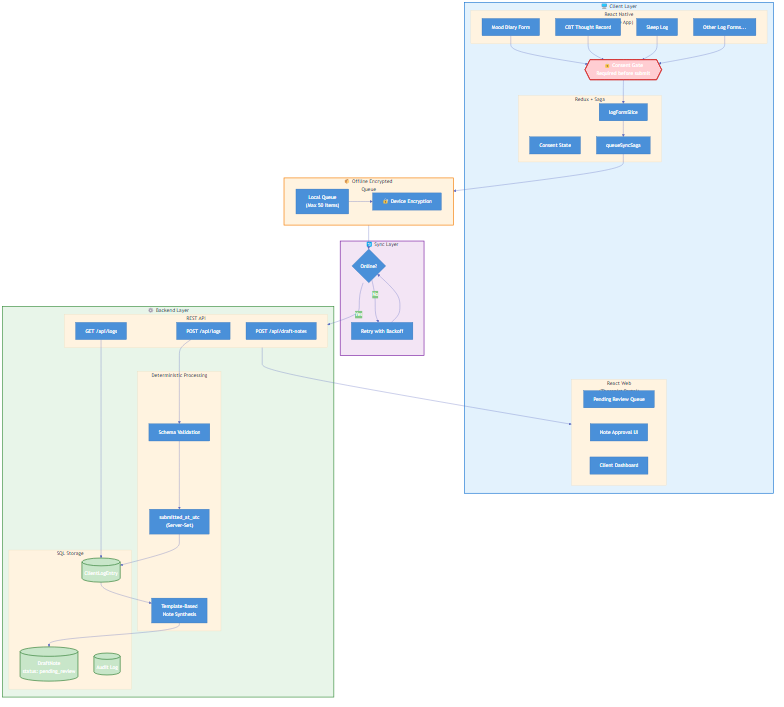

# OP_Client-Companion

> **A privacy-first, offline-capable companion app for psychology practice log collection and therapist note workflows.**

[](#compliance--guardrails)
[](LICENSE)

---

## 📋 Overview

**OP_Client-Companion** is a React Native + Web application designed to support mental health practitioners and their clients by enabling structured, schema-driven client log collection (e.g., Mood Diaries, CBT Thought Records, Sleep Logs) with a deterministic, compliance-first architecture.

### Key Principles

| Principle | Description |
|-----------|-------------|
| **Offline-First** | Logs are queued locally with encryption and synced when connectivity is available |
| **Deterministic Processing** | No AI summarization—note drafts use template-based synthesis only |
| **Consent-Gated** | Clients must explicitly consent before any data submission |
| **Privacy by Design** | PIPEDA & HIPAA alignment considerations baked into architecture |
| **UTC Timestamps** | All server timestamps in UTC; localized display only on client |

---

## 🏗️ Architecture



> 📄 Diagram source: [docs/architecture-diagram.mmd](docs/architecture-diagram.mmd) (Mermaid syntax)

---

## 📁 Project Structure

```
OP_Client-Companion/
├── app/
│   └── client-companion/          # React + Vite web app (therapist UI)
│       ├── src/
│       │   ├── features/
│       │   │   └── logForm/       # Log entry forms, consent, sagas
│       │   └── shared/            # Shared UI components
│       └── redux/                 # Redux slices
├── docs/
│   ├── Client-Log-Types.md        # Supported psychology log protocols
│   └── work-packages.json         # Sprint task definitions
├── schema/
│   ├── Client-Log-Types.json      # Machine-readable log schemas
│   └── CRS-Extension-*.json       # Extended schema definitions
├── scripts/
│   └── compliance-scan.mjs        # Static compliance & determinism checks
├── .github/
│   ├── agents/                    # Copilot agent definitions
│   ├── skills/                    # Compliance skill guardrails
│   ├── prompts/                   # Implementation prompt templates
│   └── workflows/                 # CI/CD pipelines
└── REPO-GOVERNANCE.md             # Trunk-based dev & PR policies
```

---

## 🧠 Supported Client Log Types

All log types are schema-driven and rendered dynamically from [schema/Client-Log-Types.json](schema/Client-Log-Types.json):

| Log Type | Target Conditions | Key Metrics |
|----------|-------------------|-------------|
| **Mood Diary** | Depression, Bipolar | Mood Intensity (1–10), Energy Level (1–10) |
| **CBT Thought Record** | Anxiety, Depression | Belief percentages, Emotion Intensity |
| **Sleep Log (CBT-I)** | Insomnia, Sleep Disorders | Sleep Onset Latency, Quality (1–5) |
| **Panic Attack Log** | Panic Disorder, GAD | Peak Distress (0–10), Duration (mins) |
| **Behavioral Activation** | Depression | Mastery (0–10), Pleasure (0–10) |
| **Exposure Hierarchy (ERP)** | OCD, Phobias, PTSD | SUDs Pre/Peak/Post (0–100) |
| **Food & Emotional Eating** | Eating Disorders | Hunger/Fullness Levels, Emotional State |

---

## 🚀 Getting Started

### Prerequisites

- **Node.js** ≥ 18.x
- **pnpm** (recommended) or npm/yarn
- **Git**

### Installation

```bash
# Clone the repository
git clone https://github.com/mgmacri/OP_Client-Companion.git
cd OP_Client-Companion

# Install dependencies for the web app
cd app/client-companion
pnpm install
```

### Development

```bash
# Start the development server (Vite)
pnpm dev

# Run tests
pnpm test

# Lint the codebase
pnpm lint

# Build for production
pnpm build
```

### Compliance Scan

Run the static compliance scanner to verify guardrails:

```bash
node scripts/compliance-scan.mjs
```

This checks for:
- ❌ Forbidden clinical interpretation patterns (diagnosis, crisis detection, etc.)
- ❌ Non-deterministic APIs in core logic (`Math.random`, `Date.now`, `new Date()`)
- ✅ Presence of `submitted_at_utc` usage
- ✅ Offline queue size constraints (max 50 items)

---

## 🛡️ Compliance & Guardrails

This project enforces strict compliance guardrails via code review, CI checks, and Copilot agent skills:

| Skill | Description |
|-------|-------------|
| `compliance-guardrails` | No clinical interpretation, no diagnosis, no crisis escalation |
| `timestamps-utc` | All backend timestamps in UTC; client handles localization |
| `deterministic-note-synthesis` | Template-based note generation only; no AI summarization |
| `offline-encrypted-queue` | Encrypted local queue with 50-item limit |
| `test-coverage-critical-workflows` | Critical paths require unit + integration tests |

### ❌ Explicit Non-Goals

These features are **intentionally excluded** from scope:

- Crisis detection or escalation logic
- Clinical interpretations or diagnosis
- AI-based summarization of client logs
- Non-deterministic draft note generation

---

## 🔐 Privacy & Security Considerations

> ⚠️ **Disclaimer:** This documentation is informational only and does NOT constitute legal or compliance advice. All implementations must be reviewed by qualified privacy/legal professionals.

### Design Principles

- **Consent-Gated Submission**: No data leaves the device without explicit client consent
- **On-Device Encryption**: Offline queue uses device-level encryption
- **Minimal Data Collection**: Only clinically-relevant structured fields
- **No PHI in Logs**: Application logs must never contain identifiable health data
- **Audit Trail**: All submissions include `submitted_at_utc` server timestamp

### Regulatory Alignment (Informational)

| Framework | Alignment Notes |
|-----------|-----------------|
| **PIPEDA** | Consent mechanisms, purpose limitation, data minimization principles |
| **HIPAA** | Technical safeguards (encryption), access controls, audit logging |

---

## 🧪 Testing

```bash
# Run unit tests
pnpm test

# Run tests in CI mode
pnpm test -- --ci
```

Test coverage is required for:
- Consent gate flows
- Offline queue sync logic
- Schema validation
- Timestamp handling

---

## 📖 Documentation

| Document | Description |
|----------|-------------|
| [REPO-GOVERNANCE.md](REPO-GOVERNANCE.md) | Branching strategy, PR policy, CI requirements |
| [docs/Client-Log-Types.md](docs/Client-Log-Types.md) | Psychology log protocols and field definitions |
| [docs/work-packages.json](docs/work-packages.json) | Sprint task definitions with acceptance criteria |
| [.github/copilot-instructions.md](.github/copilot-instructions.md) | Copilot agent swarm configuration |

---

## 🤝 Contributing

1. Read [REPO-GOVERNANCE.md](REPO-GOVERNANCE.md) before contributing
2. Use short-lived branches: `feat/<slug>`, `fix/<slug>`, `chore/<slug>`
3. Follow trunk-based development—keep PRs small and focused
4. Ensure all CI checks pass before requesting review
5. Complete the PR checklist from `.github/pull-request-template.md`

---

## 📄 License

This project is licensed under the ISC License. See [LICENSE](LICENSE) for details.

---

## 🙏 Acknowledgments

- Schema design informed by evidence-based psychology logging protocols
- Built with React, Redux Toolkit, Redux-Saga, and Vite
- Privacy-by-design principles guided by PIPEDA and HIPAA frameworks

---

<sub>Last updated: 2026-02-02</sub>
